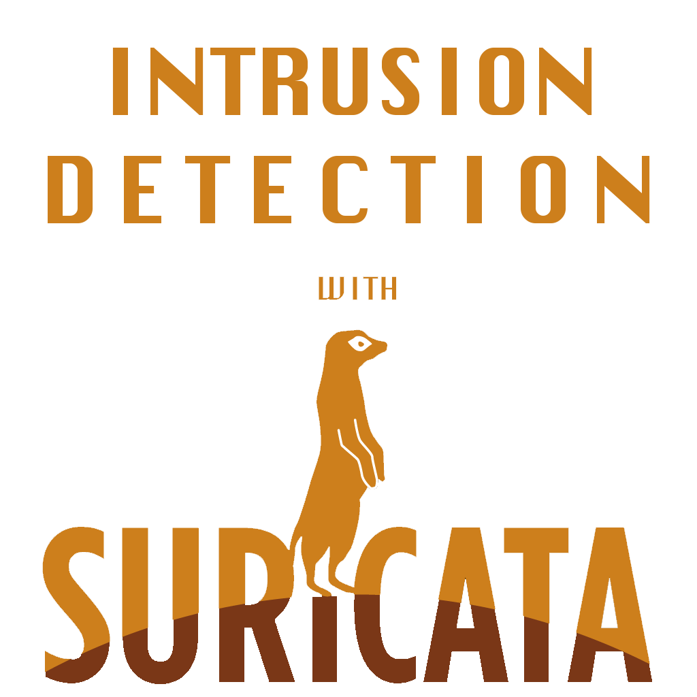
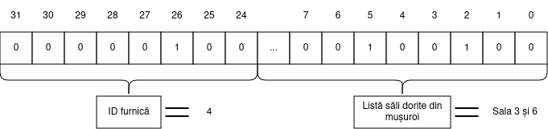
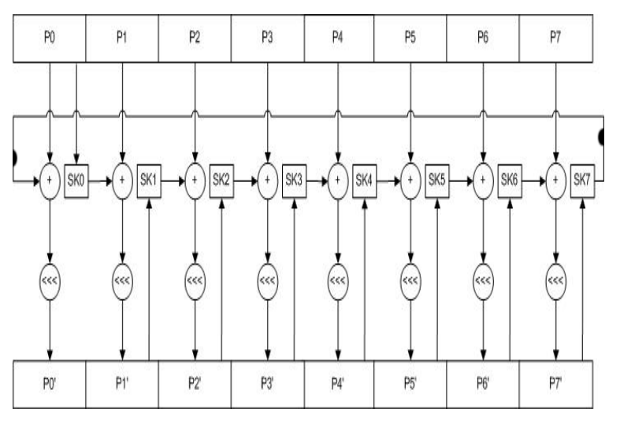
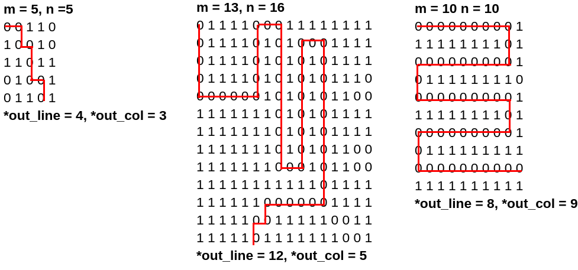
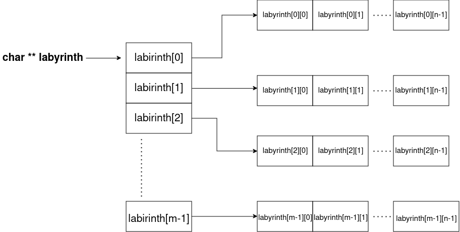

# Tema 2 - Intrusion Detection with Suricata

Suricata Zoly a exagerat în ultimele săptămâni cu pasiunea ei pentru programarea funcțională.
Ca urmare, a fost izolată de tribul ei și trebuie să își găsească o nouă casă alături de alte animale din habitat.
Pentru a nu fi considerată însă un intrus în noile vizuini, fiecare tovarăș animal îi cere lui Zoly să rezolve anumite task-uri în limbaj de asamblare.
Sarcina voastră în cadrul acestei teme este să o ajutați pe Zoly să își găsească o nouă casă.

<div align="center">
    
</div>

**Zoly vă sfătuiește să rezolvați tema pe mașina virtuală de IOCLA.**
**Dacă lucrați pe alt sistem (WSL, Linux nativ), vă sfătuiește să testați rezolvarea și pe VM-ul de IOCLA.** 


## Task 1 - Permissions

Pentru a strânge niște bani de buzunar și de călătorie, Zoly a acceptat un job la negru de la vecinele sale furnicile.

<div align="center">
    
</div>

Job-ul constă în crearea unei funcții care verifică dacă o anumită furnică-angajat are voie să rezerve sălile din mușuroi pe care le dorește.
Funcția va returna `0` dacă furnica cu id-ul `i` nu are voie să rezerve una sau mai multe din sălile pe care le dorește, respectiv `1` dacă aceasta poate rezerva toate sălile cerute.

Mușuroiul are 24 de săli, numerotate de la 1 la 24.

Pentru a-i ușura treaba lui Zoly, furnica-arhitect i-a dat o listă în care se specifică sălile pe care fiecare furnică-angajat le poate rezerva.
Lista este reprezentată de vectorul global de întregi `employee_permissions[]`, aflat în `constants.h`. Acesta poate fi accesat și din fișierul `check_permission.asm` cu ajutorul label-ului `employee_permissions`.
Elementul de la poziția `i` reprezintă lista de săli pe care furnica cu id-ul `i` le poate accesa.
Atunci când bitul `j` are valoarea `1` în elementul de la poziția `i`, furnica cu id-ul `i` poate accesa sala `j + 1`. 

**Observație** Din moment ce avem doar 24 de săli, asta înseamnă că cei mai semnificativi 8 biți ai fiecărui element din `employee_permissions[]` vor fi mereu 0.

Funcția pe care Zoly trebuie să o implementeze primește doi parametri. 
Primul argument este un număr pe 32 de biți. 
Primii 8 cei mai semnificativi biți din cadrul numărului reprezintă identificatorul `i` al furnicii.
Restul de 24 de biți au următoarea semnificație: bitul `j` ne spune dacă furnica `i` dorește să rezerve sala `j + 1`.
O furnică poate cere să rezerve mai multe săli simultan.
Funcția returnează rezultatul verificării în cel de-al doilea argument (0 sau 1)
Funcția trebuie completată în cadrul fișierului `check_permission.asm`.

Mai jos este un exemplu de input:

<div align="center">
    
</div>

Antetul funcției este următorul:
```c
void check_permission(unsigned int n, unsigned int* res);
```

Semnificația argumentelor este:
- **n**: numărul ce înglobează ID furnică și listă săli cerute
- **res**: adresa variabilei in care se scrie rezultatul verificării

## Task 2 - Requests

Pentru a intra în tribul lui, ratonul inginer îi cere lui Zoly să implementeze un sistem de login.

<div align="center">
    
</div>

Se dau structurile simplificate ale unui login request:

```c
    struct creds {
        unsigned short passkey;
        char username[51];
    };

    struct request {
        unsigned char admin;
        unsigned char prio;
        struct creds login_creds;
    };
```

### Exercitiul 1

Pentru aceasta parte a task-ului, aveti de implementat functia `sort_requests()` in fisierul *subtask1.asm*.
Această funcție va simula sortarea tuturor request-urilor de login.

Pentru a intelege mai bine cum functioneaza un login request, vom explica mai jos ce inseamna fiecare field ale structurilor:

- `admin` ne spune daca request-ul e facut de un admin
- `prio` reprezinta prioritatea pe care o poate avea un request
- `creds` reprezinta o structura de tip creds
- `passkey` reprezinta passkey-ul necesar ca login-ul sa fie realizat
- `username` reprezinta un string de identificare unic pentru fiecare request

Pentru a sorta request-urile, stabilim urmatoarele reguli:

- Request-urile trebuie sa fie sortate astfel incat request-urile facute de admini sa fie primele.
- Request-urile trebuie sortate dupa prioritate, prioritatea mai mica ca numar e mai "mare".
- Request-urile cu aceeasi prioritate trebuie apoi sortate alfabetic dupa username.

Sortarea se va face **in place**, adica vectorul `requests` prezentat mai jos va trebui, in urma apelului functiei, sa fie sortat. Antetul functiei este:

```c
void sort_requests(struct request *requests, int len);
```

Semnificatia argumentelor este:

- **requests** adresa de inceput a vectorului de request-uri
- **len** numarul de request-uri

**Atentie!** Nu puteti folosi functii externe pentru a sorta vectorul sau pentru a compara username-urile.


### Exercitiul 2

In continuarea exercitiului 1, acum trebuie sa implementati functia `check_passkeys()` in fisierul *subtask2.asm*. Această funcție va verifica daca passkey-ul din interiorul request-ului este unul corect.
Suricata Zoly s-a prins de faptul ca exista si niste hackeri care vor sa sparga sistemul, dar si de metoda
prin care vor sa pacaleasca login-ul. Acestia seteaza mereu primul bit si ultimul bit, iar pentru cei 14
biti ramasi in passkey fac urmatoarele lucruri:

- pentru cei mai putin semmnificativi 7 biti: numar par de biti de 1
- pentru cei mai semmnificativi 7 biti: numar impar de biti de 1

Exemplu:

```
    1000 1110 0110 0001 => hacker
```

Va trebui sa puneti valorile obtinute in vectorul `connected` prezentat mai jos. Veți pune 0 pentru
request-urile care nu sunt facute de hackeri, 1 altfel. Antetul functiei este:

```
void check_passkeys(struct request *requests, int len, char *connected);
```

Semnificatia argumentelor este:

- **requests** adresa de inceput a vectorului de request-uri
- **len** numarul de request-uri
- **connected** adresa de inceput a vectorului pentru conexiuni

**Se garanteaza ca toate valorile raman in limitele tipurilor de date date in structuri**

#### **Observatie**

Pentru exercitiul 2 se va folosi acelasi vector folosit si la exercitiul 1. Nu puteti face
exercitiul 2 fara sa rezolvati exercitiul 1, deoarece ordinea de parcurgere a request-urilor
trebuie sa fie cea sortata.

---


## Task 3

Tot cutrierând pe la porțile difertor animale, Suricata noastră a devenit destul
de sceptică că datele din valiza sa ar putea să fie furate în timp ce doarme.
Din această cauză, ea dorește să cripteze tot ce deține folosind un [block cipher](https://en.wikipedia.org/wiki/Block_cipher),
însă vrea ca acesta să fie cât mai simplu.

<div align="center">
    
</div>

După mai multe nopți nedormite de gândire, aceasta se decide asupra cifrului [Treyfer](https://en.wikipedia.org/wiki/Treyfer),
care pentru a cripta un bloc de **8 bytes** de date după următoarea schemă:

<div align="center">
    
</div>
<div align="center">
<em>Sursă: A. Kircanski and A. M. Youssef, "A Related-Key Attack on TREYFER"</em>
</div>

În figura de mai sus, `P0` până la `P7` reprezintă cei 8 bytes din bloc,
`SK0` până la `SK7` reprezintă cei 8 bytes din cheia secretă, iar `<<<`
reprezintă operația de rotație la dreapta. Acestă operație
se poate repeta de un număr `n` de runde.

Întrucât schema de mai sus poate să fie neintuitivă, descriem și în limbaj natural atât procdeura de **criptare** cât și de **decriptare**.

Pentru **criptare** se pornește cu o variabilă pe 8 biți `t`, ce reprezintă starea
criptării. Inițial, aceasta este primul byte al blocului de criptat.

La fiecare rundă, pentru fiecare byte de pe poziția `i` din blocul de criptat:
1. Se adună la variabila de stare byte-ul corespunzător din **cheia secretă**
2. Se substituie variabila de stare cu corespondentul acesteia într-un [S-Box](https://en.wikipedia.org/wiki/S-box), definit în scheletul temei.
3. Se adună **următorul** byte din bloc. Dacă vorbim de ultimul byte, atunci următorul byte va fi cel de pe poziția 0. 
4. Variabila de stare suferă o rotație la stânga cu 1 bit.
5. Byte-ul de pe poziția `(i + 1) % 8` din bloc va fi actualizat cu valoarea variabilei de stare.

Pentru **decriptare**, vom parcurge blocul **în sens invers**  la fiecare rundă
și vom efectua următoarele operații:
1. Luăm byte-ul curent din bloc și adunăm byte-ul corespondent din cheia secretă
2. Aplicăm același `S-box` pe byte-ul nou format. Notăm acest rezultat cu `top`.
3. Luăm byte-ul următor din bloc (poziția `(i + 1) % 8`) și îi aplicăm o rotire la dreapta cu 1 bit. Notăm acest rezultat cu `bottom`.
4.  Byte-ul de pe poziția `(i + 1) % 8` din bloc va fi actualizat cu diferența `bottom - top`.

Pentru o înțelegere mai bună a procesului de criptare/decriptare, Zoly s-a gândit
la următorul exemplu ce ilustrează **o rundă** de criptare pentru blocuri de **2 bytes**
(procedeul este similar pentru dimensiunea reală a blocului, **8 bytes**):

**Criptarea** textului "mo" cu cheia "da" folosind **S-Box**-ul din scheletul temei:

**Starea inițială (0)**
```
text:   m   o
ascii:  109 111
stare(t): 109
```

**Pasul 1**:
1. Adunăm byte-ul corespunzător al cheii (`'d' = 100`): `t = 109 + 100 = 209`
2. Facem substituția t = sbox[t], în cazul nostru `sbox[209] = 135`
3. Adunăm următorul byte din bloc ('o' = 111): `t = 135 + 111 = 246`
4. Aplicăm o rotație la stânga pe t: `t = 246 <<< 1 = 237`
5. Actualizăm byte-ul de pe poziția 1 cu valoarea lui t, ajungând la următoarea stare:
    ```
    ascii: 109 237
    stare (t): 237
    ```

**Pasul 2**:
1. Adunăm byte-ul corespunzător al cheii (`'a' = 97`): `t = 237 + 97 = 78` (luând în considerare overflowul pe 1 byte)
2. Facem substituția t = sbox[t], în cazul nostru `sbox[78] = 169`
3. Adunăm următorul byte din bloc (`109`): `t = 169 + 109 = 22` (după overflow)
4. Aplicăm o rotație la stânga pe t: `t = 22 <<< 1 = 44`
5. Actualizăm byte-ul de pe poziția 0 cu valoarea lui t, ajungând la următoarea stare:
    ```
    ascii: 44 237
    stare (t): 44
    ```

Pentru **decriptare**, vom porni de la starea tocmai criptată și vom folosi aceeași cheie secretă:
```
ascii: 44 237
```

**Pasul 1**:
1. Luăm byte-ul de pe ultima poziție și adunăm byte-ul corespondent al cheii (`'a' = 97`) => `237 + 97 = 78`
2. Întrucât `sbox[78] = 169`, notăm `top = 169`
3. Rotim byte-ul următor din bloc (în cazul nostru poziția 0) la dreapta: `44 >>> 1 = 22`, deci `bottom = 22`
4. Calculăm rezultatul `bottom - top = 22 - 169 = 109` (după underflow) și actualizăm byte-ul de pe poziția 0, ajungând la starea:
    ```
    ascii: 109 237
    ```

**Pasul 2**:
1. Luăm byte-ul de pe prima poziție și adunăm byte-ul corespondent al cheii (`'d' = 100`) => `109 + 100 = 209`
2. Întrucât `sbox[209] = 135`, notăm `top = 135`
3. Rotim byte-ul următor din bloc (în cazul nostru poziția 1) la dreapta: `237 >>> 1 = 246`, deci `bottom = 246`
4. Calculăm rezultatul `bottom - top = 246 - 135 = 111` și actualizăm byte-ul de pe poziția 0, ajungând la starea inițială:
    ```
    ascii:  109  111
    text:   m    o
    ```

Sarcina voastră este să o ajutați pe Zoly să implementeze metode de criptare și
decriptare pentru acest cifru, în cazul cu `10` runde de criptare și dimensiunea blocului de `8` bytes.
Mai precis, va trebui să implementați funcțiile:

```c
void treyfer_crypt(uint8_t text[8], uint8_t key[8]);
void treyfer_dcrypt(uint8_t text[8], uint8_t key[8]);
```
Aceste funcții vor modifica **in-place** blocul de criptat/decriptat. Astfel,
veți modifica în mod direct memoria din array-ul `text` dat ca parametru cu rezultatul criptării/decriptării.

---

## Task 4 - Labyrinth
Suricata Zoly a ajuns acum și la ultima încercare: labirintul pus în calea ei de către ursul Maloo(ma).
Pentru a rezolva acest task, trebuie să o ajutați pe Zoly să găsească ieșirea din labirint,
rezolvând infama problemă **BDLP** (Break Dynamic Labyrinth Problem).

<div align="center">
    
</div>

Labirintul ursului Maloo(ma) are forma unui array bidimensional (o matrice) de caractere, alocat dinamic.
Codificarea labirintului este următoarea:
- Fiecare element din matrice reprezintă o celulă a labirintului.
- Atunci când valoarea unui element din matrice este `1` (cod ASCII `0x39`), acea celulă este reprezentată de un zid, iar Zoly nu se poate deplasa în ea.
- Atunci când valoarea unui element din matrice este `0` (cod ASCII `0x30`), acea celulă este liberă, iar Zoly se poate deplasa în ea.

Poziția suricatei în labirint este reprezentată mereu de o pereche (linie, coloană).
Dacă labirintul are `m` linii și `n` coloane, vom avea linii și coloane numerotate de la `0` la `m - 1`, respectiv de la `0` la `n - 1`.

Suricata va porni mereu din poziția `(0, 0)` și se poate deplasa în una din căsuțele vecine de sus, de jos, din dreapta sau din stânga.
Suricata nu se poate deplasa în diagonală.

Ieșirea din labirint este atinsă în momentul în care suricata reușește să ajungă pe linia `m - 1` sau pe coloana `n - 1` a labirintului.
Scopul nostru este să aflăm linia și coloana de ieșire din labirint.

Pentru simplificarea task-ului, ursul Maloo(ma) oferă următoarele garanții:
- **Din fiecare poziție curentă, suricata Zoly poate accesa doar poziția precedentă (lucru care trebuie evitat, pentru a nu se întoarce înapoi pe drum) și o singură poziție viitoare, restul căsuțelor vecine fiind ocupate de ziduri.**
- Labirintul are o singură rezolvare corectă.

Pentru acest task, va trebui să implementați în fișierul `labyrinth.asm` funcția `solve_labyrinth()`.

Antetul funcției este:

```c
void solve_labyrinth(unsigned int *out_line, unsigned int *out_col, unsigned int m, unsigned int n, char **labyrinth);
```

Semnificația argumentelor este:
- **out_line**: pointer la index-ul liniei corespunzătoare căsuței prin care suricata iese din labirint
- **out_col**: pointer la index-ul coloanei corespunzătoare căsuței prin care suricata iese din labirint
- **m**: numărul de linii din labirint
- **n**: numărul de coloane din labirint
- **labyrinth**: array-ul bidimensional, alocat dinamic, care conține reprezentarea labirintului

Codul vostru trebuie să rezolve labirintul și să salveze la adresa `out_line` index-ul liniei de ieșire, respectiv la adresa `out_col` index-ul coloanei de ieșire.

**Puteți modifica conținutul (caracterele) din matricea `labyrinth`.**

Mai jos avem câteva exemple de labirint și de rezolvare a acestuia.



### Indicație

O matrice alocată dinamic are forma din figura de mai jos.
Spre deosebire de un array bidimensional alocat static, în acest caz nu putem garanta că liniile succesive din matrice vor fi plasate una în continuarea celeilalte în memorie, ci doar că fiecare linie este continuă în memorie.
Pentru mai multe detalii, puteți consulta și [această secțiune](https://github.com/systems-cs-pub-ro/iocla/tree/master/laborator/content/operatii-memorie-gdb#pointeri-la-tablouri) din laborator.



---

**Suricata Zoly vă mulțumește pentru ajutor și vă așteaptă și la tema 3 ;)**

<div align="center">
    
</div>
